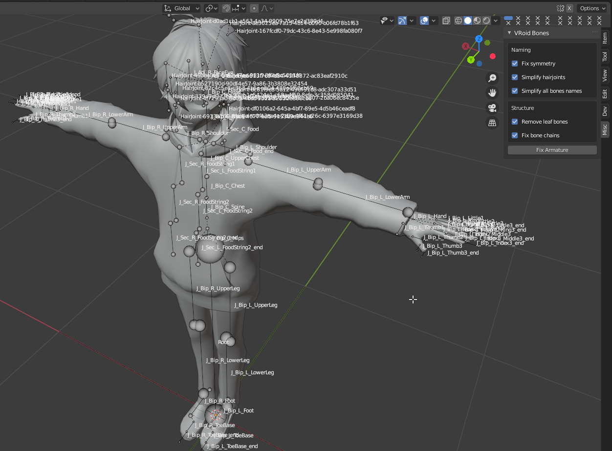
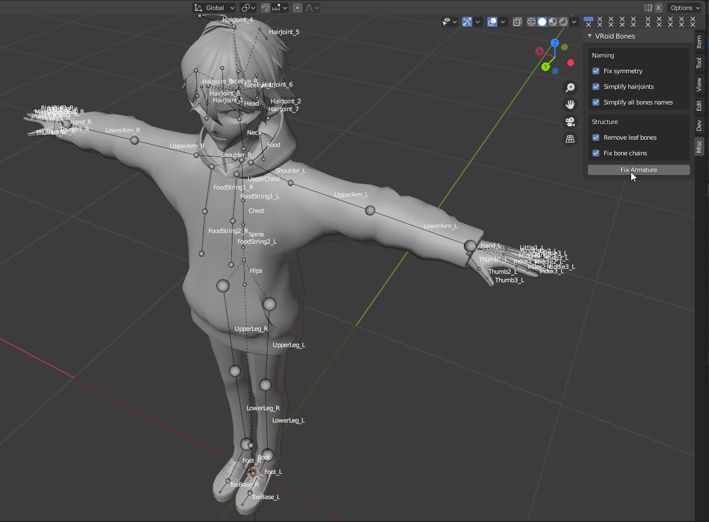

# VRoidBones for Blender
Blender's "make it pretty" button for armatures imported from VRoidStudio.

----

Look at this armature this is ugly as hell!! Bones are __not properly connected__ to each other, have __weird names__, and does not match blender's __left/right bone naming convention__.

This addon addresses exactly these issues, with a single button press armature becomes nice and pretty. Plus, it can setup inverse kinematics and finger constraints for you, so you can dive straight into animating your character!

## Installation

1. Download latest release from [releases page](https://github.com/cmd410/VRoidBonesRenamer/releases)
2. Open Blender 2.8 or higher
3. Navigate to `edit -> preferences -> addons`
4. Click `Install...` button and choose the downloaded zip archive
5. Check `VRoid Bones` addon in the list
6. Enjoy!

## Features

- Fix bone symmetry naming
- Simplify bones' names
- Remove unneeded leaf bones
- Properly connect bones
- Setup Inverse kinematics
- Setup fingers constraints

## Usage

First of all you need a model from VRoidStudio. Make whatever character you want and export it in `.vrm` format. Then rename exported file to `[whatever].glb` . Now you can import it into blender with GLTF/GLB importer. After you do that, select character's armature and go into edit mode. In the `N` Panel you can find a `Misc` tab where all the addon's controls are. By default it does full cleanup and does not require changing a thing, just press `Fix Armature` button.